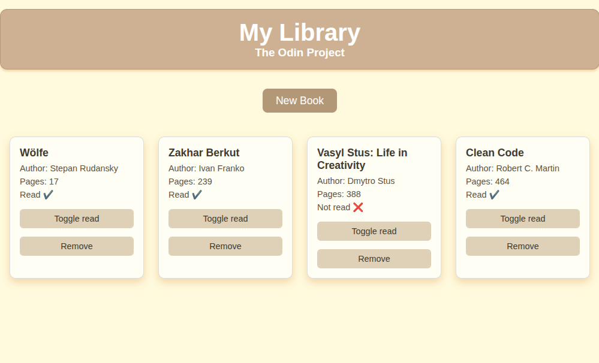

# My Library (The Odin Project, Lesson 1)

A simple JavaScript library app to add, remove, and toggle the read status of books.

## 🚀 Live Demo

👉 [View the project live on GitHub Pages](https://mmm.github.io/library-the-odin-project-js1/)

## Features

- Add a new book with title, author, pages, and read status.
- Remove a book from the library.
- Toggle read/unread status.

## Built with

- JavaScript
- HTML
- CSS

## Interface

